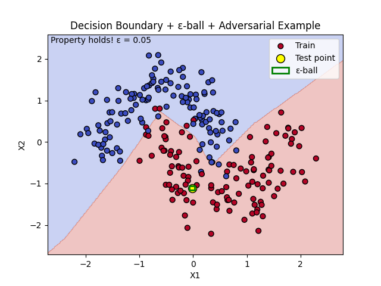

## Quick Summary

- Use a tiny feed-forward neural network (2-3 layers)
- Train it on a simple 2D toy dataset
- Encode the network as linear arithmetic and piecewise ReLU constraints in Z3
- Check a robustness property by asking Z3 for a counter exammple (SAT -> adversarial example)

#### Some Reading Links:

*Pdfs can be found in the directory folder.*

---

# Week 1: 

### Environment Setup

Create the virtual environment to isolate dependencies. Make sure z3 is installed and working correctly using the dummy `z3_test.py` script that should print *unsat*.

### Dataset and Network Choice for Initial Creation and Debugging Purposes

I chose to use the `sklearn.datasets.make_moons` dataset as my inital experimental dataset. I wanted to keep it small becuase I know that SMT encodings will scale poorly because each neuron will add variables and piecewise cases - if I keep the input dimenstionality to 2D as in make moons and pair it with a small network, I can get a tractable verification for Z3 and get a working pipeline quickly. Then as time permits with this project I can try a small MNIST subset - maybe 3D or downsampled - and see how it works.

**Architecure Idea:** Input(2) -> Dense(8) ReLU -> Dence(4) ReLU -> Dense(2) (logits)

I will use PyTorch to save weights and biases of the model so that I can hardcode those floats into the SMT model. 

#### Formal Property to Verify:

Let $x_0 \in  \mathbb{R}^n$ be a (test) input classified by the network class as class $c$. For a chosen $\epsilon >0$ we wnat to verifty that:

- For all $x$ with $|| x- x_0 ||_{\infty} \leq \epsilon$, the network's predicted class remains $c$. 

Using that, we want to use the SMT checker performed on the *negation* because we are interested in the Satisifiability of our query.
- `x_i in [x0_i - eps, x0_i + eps]` for network computation and constraints
- Asserts $\exists x$ within those constraints such that $argmax(output) \neq c$
    - $Or(ouput[j] \geq output[c], for some j != c)$
- SAT if adverserial input found AKA counterexample
- UNSAT if propoerty holds because its proved with the encoding


1. Introduce Real variables
    - $x_0, x_1, ..., x_{n-1}$ which will be constrained to the $\epsilon$ box
    - For each neuron that I have in the hidden layers, introduce a Real variable representing the pre-activation $z$ and maybe the post-activation/post-ReLU $a$
2. Layer constraints
    - For a layer with weights `W` and biases `b` and previous layer actications `aprev`, the linear constraints that I want to add would be: $z_i = \sum _j W[i][j] * aprev_j +b_i$
    - In Z3 thats: `s.add(z_i == Sum([RealVal(W_ij)*a_prev_j, ...]) + RealVal(b_i))`
3. ReLU Encodings
    - There are two possibilites that I saw referenced throughout the literature, want to include both here in case the first one that I try does not work and I want to go back and try the other
    - The simple version which should work well for the smaller testing but may have a problem when I start to scale up would just be to sue the simple If/Then encoding that would work directly in Z3: `a_i = If(z_i >= 0, z_i, 0)`
    - I could also do **Phase Boolean Encoding** which introduces Bool phase_i and constraints and is supposed to me more friendly at scale. But I have never worked with that before and will probably try to stay away from that if possible

    ```csharp
    phase_i => a_i == z_i
    Not(phase_i) => (a_i == 0 and z_i <= 0)
    ```

4. Output/Classification Constraints
- After the final layer of my NN I have logits $o_0, o_1, ..., o_{k-1}
- For my target class $c$, the negated property is `Or([o_j >= o_c for j != c])

5. Introduce small distruption (perturbation) constraints
- For each input dimension `i`, constrain `x_i >= x0_i - eps` and `x_i <= x0_i + eps`

6. Solver check

### Tips from some of the Papers

- SMT-based checking for ReLU networks is very compute-intensive so its best to start with 2D + tiny nets. Scaling with Z3 might not work well so may want to look into Marabou or more specialized verifiers if you want to scale with more neurons. Those verificers implement optimizations like case splitting, bound propagation, and specialized simplex extenstions (don't know what those are but might be cool to investigate more)
- **Encoding choices matter** so may have to figure out if If vs explicit Boolean phase variables works better for the scale that I am operating at — explicit Booleans + clever search heuristics can help the solver but complicate implementation. Read Reluplex/Marabou papers for solver strategies if I decide to go in that direction
- I should use Real (rationals) in Z3 for exactness. Converting many floats to RealVal is fine but may slow things down quite a bit and sometimes using Rational approximations helps reproducibility.
- Z3 returns a model with rational values; When I am trying to extract the counter example, I have to convert to floats for re-running through the original network to verify the misclassification.

## To Run Week1 Stuff

In virtual environment:

`cd week1`

`python3 train_toy_network.py`

ex output: 
```bash
Epoch 50, loss=0.2798, train_acc=0.887
Epoch 100, loss=0.1225, train_acc=0.958
Epoch 150, loss=0.0775, train_acc=0.971
Epoch 200, loss=0.0671, train_acc=0.975
Test accuracy: 1.000
```

`python3 verify_tinynet.py`

ex output:

```bash
Epoch 50, loss=0.3983, train_acc=0.879
Epoch 100, loss=0.3040, train_acc=0.887
Epoch 150, loss=0.2515, train_acc=0.917
Epoch 200, loss=0.1617, train_acc=0.954
Test accuracy: 0.950
Saved weights to tiny_net_weights.json
Test sample index 0
True label: 1, Predicted class: 1
Input (normalized): [-0.02015479 -1.11107685]

Running Z3 solver...
Z3 result: unsat

Property holds!
No adversarial example found within ε = 0.05.
```



---

# Week 2

**Plan for Week 2**
1. Train a few small networks (to include variants from the week one Tiny Net)
2. Improve the SMT encoding pipeling
    - compute pre-activation bounds with interval arithmetic. This will help determine which ReLus are active/inactive so that expensive Boolean case splits can be avoided (from abstract interpretation/ DeepPoly/ ERAN papers)
    - For the neurons in the NN with an ambiguous sign (their pre-activation interval straddles 0), encode using `If`. The Reluplex and Marabou papers talk about how phase splitting and lazy case-splitting improve the solver's performance as networks get larger
3. For each test point, check the ball robustness with different $\epsilon$ values.
    - Record solver outcome (sat/unsat)
    - Record runtime

I want to start by creating 2 new files: `train_variants.py` and `verify_improved.py` which will train new models and imrpove the verification script respectively.

---

# Week 3

My plan for this week is to pick one advanced, but traceable monedl (MNIST small convnet) and perform 8 in-depth case studies that combine PGD/CW attacks, interval/DeepPoly triage, and exact SMT checking with a z# solver to explain why the model is or is not rpbust for different epsilon values.

**PGD:** Projected Gradient Descent. iterative attack that repeatedly applies small steps in the direction of the gradient loss functionn to maximize the prediction error. at each iteratio, the perturbed input is projected into a predefined feasible set around the original input to ensure that the total perturbation remains small and visually inperceptible

**CW:** Carlini & Wagner. more sophisticated, optimixzation based method. Solves a complex optimization problem to find the minimal perturbation required to cause a misclassification with a high degree of confidence. More computationally intensive, so unsure if I will be able to implement but want to try.

For each case study:
1. Emperical search: run strong PGD (multi-restart)and CW to find adverserial examples incaise eps - hopefully fast and good to find easy failures.
2. Abstract raiageL compute the IBD/DeepPoly bounds for the eps-ball to see if the point is provably safe or clearly unsafe or amiguous. Right now I am starting with Z3 but may go to ERAN+Marabou which was suggested by many of the papers depending on the results of this experimentation
3. SMT exact check with Z3: for ambioguous cases, encdoe the network and eps-ball into Z3 and ask for a counterexample (get from negated universal property). From Reluplex paper
    - if Z3 returns `sat`, get the exact counter example
    - if `unsat`, proof with encoding
4. Deeper analysis of any counter example: Look at per-layer pre-post activations, ReLU phase flips, activation map visualizations, gradient/attribution maps, and minimal vectory space required (binary search and attack). Want a WHY the netwrok failed
